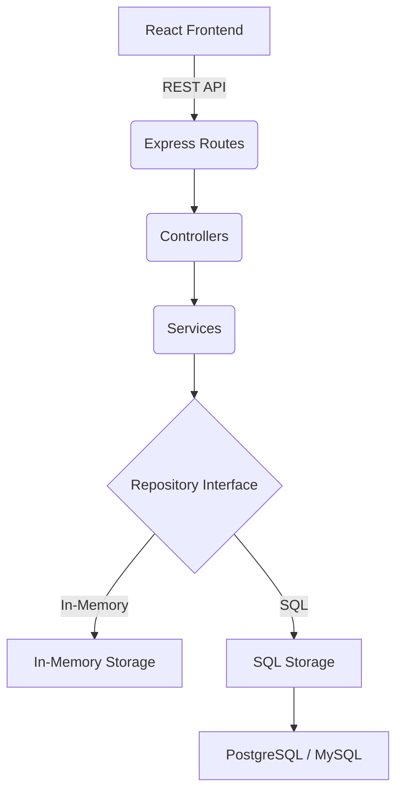

# Day Status Management System

Production-ready full-stack React and Node.js application for authenticated daily status management and public calendar-based day viewing.

## Overview
This application provides two primary components:
1. **Data Input Component:** An authenticated interface with a 12x31 grid allowing users to input status data for every day of the year.
2. **Day Status Viewer:** A public interface displaying the stored day statuses using a user-friendly calendar layout.

## Features
- **Public Calendar Viewer:** Anyone can select dates and view recorded data.
- **Authenticated Input Grid:** A fully responsive, spreadsheet-like grid to input data.
- **Date Handling:** Correct leap-year validation and day-count constraints.
- **Storage Flexibility:** Easily toggle between in-memory storage and persistent SQL storage (Postgres/MySQL) without changing business logic.
- **Security:** Complete JWT-based authentication and secure password hashing.

## Architecture
The application uses a clean modular-monolith architecture.



## Tech Stack
- **Frontend:** React, Vite, TypeScript, Tailwind CSS, Axios, React Router.
- **Backend:** Node.js, Express, TypeScript, Zod, Sequelize ORM.
- **Database:** PostgreSQL (default via Docker), MySQL compatible.

## Database Design
- `users`: id, email, password_hash, created_at, updated_at
- `day_statuses`: id, date (YYYY-MM-DD), status (Text), created_by (FK), created_at, updated_at
  - Unique constraint on `date`.

## Storage Abstraction
The system supports two storage modes controlled via `STORAGE_MODE` in `.env`:
- `in-memory`: Uses internal arrays. Perfect for testing and ephemeral demos. Data vanishes on restart.
- `sql`: Uses Sequelize to connect to PostgreSQL/MySQL. Data persists.

## Installation & Setup

1. **Clone the repository**
2. **Setup Environment Variables:**
   ```bash
   cp .env.example .env
   ```
3. **Start the database using Docker:**
   ```bash
   docker-compose up -d postgres
   ```
4. **Install Dependencies:**
   ```bash
   npm run install:all
   ```
5. **Run tests:**
   ```bash
   npm run test:backend
   ```
6. **Start Frontend & Backend:**
   ```bash
   # Terminal 1
   npm run dev:backend
   
   # Terminal 2
   npm run dev:frontend
   ```

## API Documentation
- `POST /api/auth/login` - Authenticate user
- `POST /api/auth/register` - Create user
- `GET /api/auth/me` - Get current user profile
- `GET /api/day-status?year={year}&month={month}` - Get statuses
- `GET /api/day-status/:date` - Get status for a specific date
- `PUT /api/day-status/:date` - Update status (Requires Auth)

## Assumptions
- "Data entered for each day" is assumed to be a textual note/status field.
- Admin user is automatically seeded on server startup if it doesn't exist.

## Demo Credentials
- **Email:** admin@example.com
- **Password:** password123
